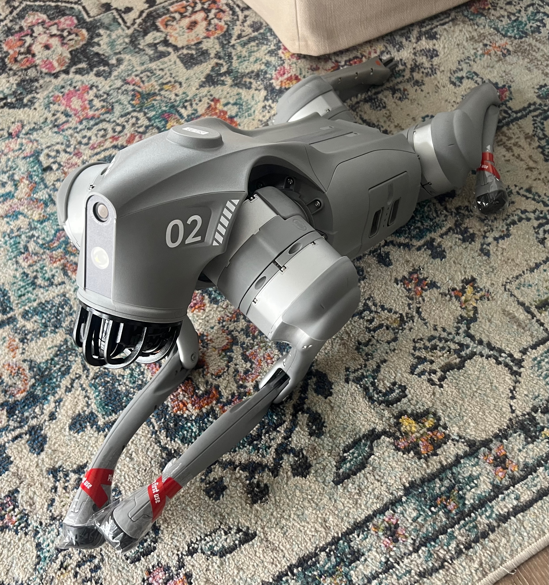

# animal2robot 🐾

It started with a chance encounter.

A few months ago I crossed paths with **Spot** — Boston Dynamics' four-legged robot — roaming the halls of Lawrence Berkeley National Laboratory on a mission: autonomously hunting down radioactive sources and mapping radiation fields in 3D, in real time. Sensors strapped to its back, lidar humming, completely unbothered by the gamma rays flying around it. I stood there watching it trot past and felt my heart do something embarrassing.

That was it. Decision made. My next pet was going to be a robot dog.


*Mochi on arrival day. Still in shipping wrap. Full of potential.*

Meet **Mochi** — my Unitree GO2, my new best friend, and my future emotional support animal. Yes, I'm aware it doesn't have fur. Yes, I'm aware it can't cuddle. We don't talk about that.

Mochi walks just fine. But watching real dogs move — the fluid rhythm of a trot, the way a paw placement triggers the next, the effortless coordination of four legs doing four different things — made me wonder: *could Mochi learn to move like that?* And more importantly, could it learn just from watching videos?

---

## The Research Question

Most quadruped locomotion labs that train robots on animal gaits rely on **controlled setups** — real animals fitted with motion capture suits or inertial sensors, recorded in lab environments. The data is clean, structured, and expensive to collect.

This project asks a scrappier question:

> **What if we skip all that and just use random dog videos from the internet?**

Phone footage, YouTube clips, dogs running in parks — uncontrolled, in-the-wild video. If we can extract reliable gait priors from that kind of data, we unlock a massive, free, and incredibly diverse dataset of animal motion. And once the pipeline works for dogs, there's nothing stopping us from pointing it at a cat, a horse, or — eventually — a cheetah.

The full pipeline has four acts:

**Act 1 — Learn from real dogs** ← *this repo*
```
wild dog video → RF-DETR Keypoint → per-frame keypoints → gait representation
```

**Act 2 — Train Mochi in simulation**
```
gait representation → motion prior → RL training in sim → locomotion policy
```

**Act 3 — Bring it into the real world**
```
sim policy → sim-to-real transfer → Mochi walks
```

**Act 4 — Close the loop**
```
film Mochi on the same path → extract gait (same pipeline) → compare to original dog
```

The same tool used to measure is used to teach. We extract gait priors from dog videos, shape a locomotion policy in simulation with RL, transfer it to Mochi, then film Mochi walking the same route and run it through the exact same pipeline. The comparison quantifies how close Mochi got — and where the gap still is.

This repo implements **Act 1**. Acts 2–4 are the roadmap.

It's a quantitative answer to the question my friends keep laughing at: *can a robot dog become an emotional support animal?* We're starting with the gait. One step at a time. 🐾

---

## What the Pipeline Extracts

- 🐾 **Per-paw trajectories** — where each paw goes, normalized to body scale so it works across dog sizes
- 🎵 **Stride frequency** — how fast the dog is stepping (FFT + autocorrelation)
- ⏱️ **Inter-limb phase** — which paw leads, which follow, and by how much of a stride cycle

---

## Repository Structure

```
src/animal2robot/
├── datasets.py          Dataset registry (DatasetSpec, species filtering)
├── config.py            Settings via environment variables / .env
├── inference/
│   ├── base.py          Abstract InferenceBackend
│   ├── local.py         Local .pth checkpoint (GPU required)
│   └── roboflow.py      Roboflow hosted inference API
├── pipeline/
│   ├── video.py         Video → per-frame keypoints DataFrame
│   └── gait.py          Keypoints → gait representation JSON
└── api/
    ├── app.py           FastAPI server
    └── schemas.py       Pydantic response models

training/
├── dataset.py           Auto-download and dataset preparation
├── train.py             torchrun entrypoint (multi-GPU via SLURM)
├── config.yaml          Hyperparameters and dataset selection
├── submit.sh            Generic SLURM job script
└── converters/
    └── coco_to_yolo.py  COCO → YOLO format converter

tests/
└── test_gait.py         Unit tests for gait extraction (no GPU needed)
```

---

## Supported Datasets

Dogs are the default. Mochi has standards.

| Dataset | Images | Keypoints | Species | Format |
|---|---|---|---|---|
| `dog-pose-ultralytics` | 8,476 | 24 | dog | YOLO |
| `ap10k` | 10,015 | 17 | 54 species | COCO → converted |
| `animal-pose` | ~5,000 | 20 | dog, cat, horse, sheep, cow | COCO → converted |

Species can be mixed and matched via `config.yaml`. Default: dogs only. (Cheetah mode coming eventually.)

---

## Setup

```bash
git clone https://github.com/annkasch/animal2robot.git
cd animal2robot

# Roboflow inference backend (no GPU needed)
pip install -e ".[roboflow]"

# Local inference backend (GPU required)
pip install -e ".[local]"

# GPU cluster training
conda env create -f environment.yml
conda activate animal2robot
```

Create a `.env` file:

```bash
INFERENCE_BACKEND=roboflow
ROBOFLOW_API_KEY=your_key
ROBOFLOW_MODEL_ID=your_model_id

# Or for local inference:
# INFERENCE_BACKEND=local
# LOCAL_CHECKPOINT=checkpoints/rfdetr_dog_pose/best.pth
```

---

## Running the API

```bash
uvicorn animal2robot.api.app:app --reload
```

Point it at a dog video:

```bash
curl -X POST http://localhost:8000/predict/video \
     -F "file=@dog_walk.mp4" | python -m json.tool
```

**Response:**

```json
{
  "stride_frequency_hz": 2.3,
  "inter_limb_phase": {
    "left_front_paw": 0.0,
    "right_front_paw": 0.501,
    "left_back_paw": 0.498,
    "right_back_paw": 0.003
  },
  "paw_trajectories": { "left_front_paw": [{"t": 0.0, "x": 0.12, "y": 0.43}, ...] },
  "video_meta": {"fps": 30.0, "width": 1920, "height": 1080, "total_frames": 300}
}
```

---

## Training

Training runs on a GPU cluster via SLURM. The dataset downloads and prepares itself automatically on first run — no manual steps needed.

**1. Configure** `training/config.yaml`:

```yaml
dataset: dog-pose-ultralytics   # or: ap10k, animal-pose
species: [dog]                  # extend: [dog, cat, horse, ...]
epochs: 50
batch_size: 8
```

**2. Submit:**

```bash
# Edit --partition and ENV_PATH in submit.sh for your cluster
sbatch training/submit.sh
```

**3. Or single GPU:**

```bash
torchrun --nproc_per_node=1 training/train.py --config training/config.yaml
```

---

## Tests

```bash
pip install -e ".[dev]"
pytest tests/
```

No GPU needed — tests use synthetic gait signals to verify the math.

---

## Environment Variables

| Variable | Default | Description |
|---|---|---|
| `INFERENCE_BACKEND` | `roboflow` | `local` or `roboflow` |
| `LOCAL_CHECKPOINT` | — | Path to trained `.pth` file |
| `ROBOFLOW_API_KEY` | — | Roboflow API key |
| `ROBOFLOW_MODEL_ID` | — | Roboflow model ID |
| `ROBOFLOW_WORKSPACE` | — | Roboflow workspace (dataset download) |
| `ROBOFLOW_PROJECT` | — | Roboflow project (dataset download) |
| `CONF_THRESHOLD` | `0.3` | Keypoint confidence threshold |
| `DATASET` | `dog-pose-ultralytics` | Active dataset spec |

---

*Mochi is still learning. Aren't we all.* 🤖🐾
